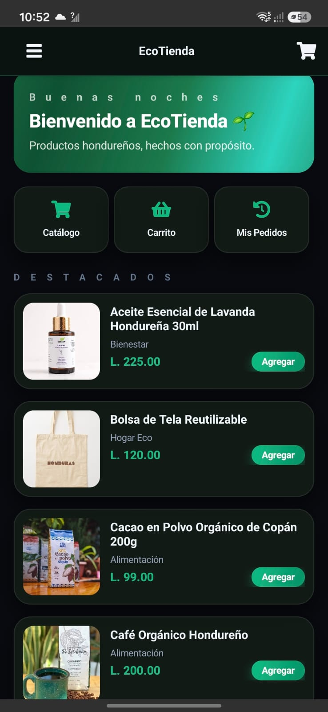
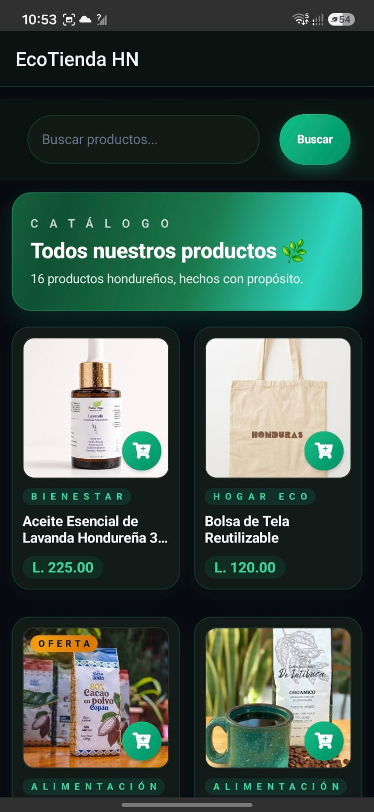
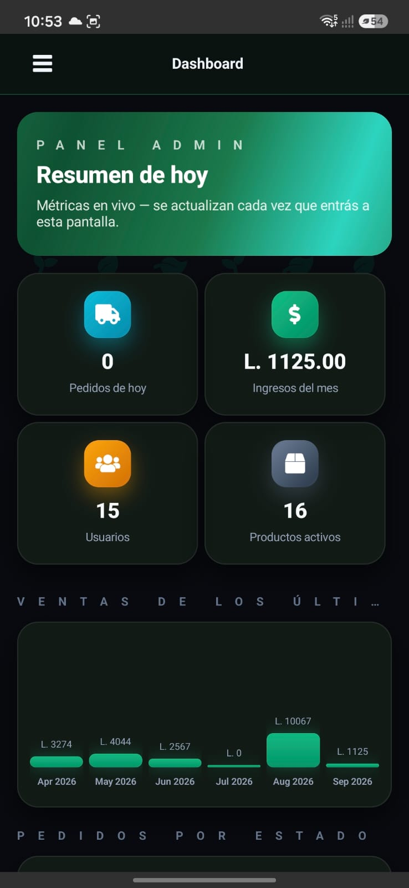
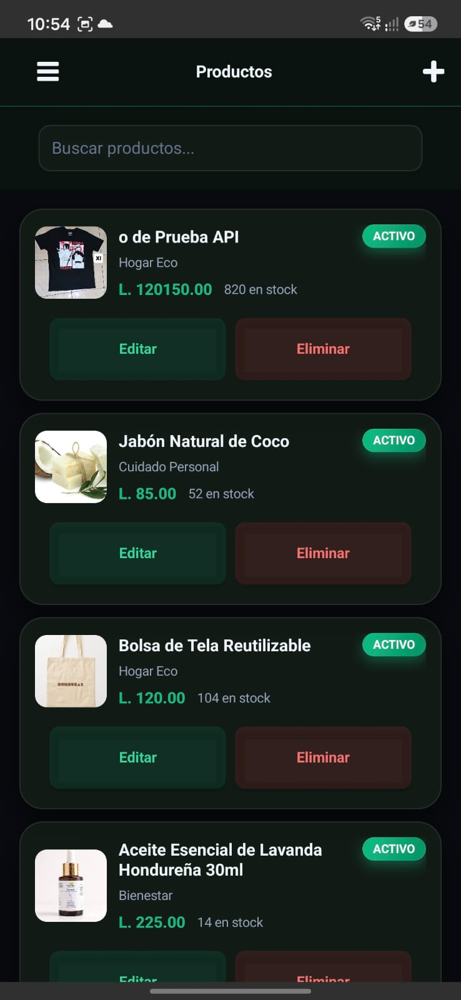

<div align="center">

# 🌿 EcoTienda HN

### Marketplace de Productos Ecológicos Hondureños

[](https://php.net)
[](https://mysql.com)
[](https://getbootstrap.com)
[](https://developer.paypal.com)
[](https://chartjs.org)
[](LICENSE)

**E-commerce completo desarrollado como proyecto universitario en CEUTEC Honduras.**
Conecta consumidores con productores ecológicos locales a través de una plataforma moderna, segura y escalable.

[📋 Reportar un bug](../../issues) · [🌱 Funcionalidades](#-funcionalidades) · [🚀 Instalación](#-instalación-paso-a-paso)

</div>

---

## 📸 Capturas de pantalla

> _Agregar capturas del sitio web (Home, Tienda, Checkout) en `/screenshots` cuando estén disponibles._

### 📱 Cliente móvil (NativeScript + Angular)

Esta misma API en PHP también sirve de backend a una app móvil desarrollada en NativeScript + Angular:

| Home | Catálogo | Dashboard admin |
|:---:|:---:|:---:|
|  |  |  |
| **Menú lateral** | **Gestión de productos (admin)** | |
|  |  | |

---

## ✅ Funcionalidades

### 🛒 Tienda / Cliente
- Catálogo de productos ecológicos hondureños con búsqueda en tiempo real (AJAX)
- Filtros por categoría, precio y disponibilidad, con paginación
- Carrito dinámico (`api/carrito.php`) actualizado sin recargar la página
- **Checkout con dos flujos de pago completos:**
  - **PayPal Sandbox** de punta a punta (`checkout-crear-orden.php` → `checkout-capturar-pago.php` → `paypal-return.php`)
  - **Transferencia / pago manual** con comprobante subido por el cliente (`checkout-pago-manual.php`)
- Validación de cupones de descuento (`api/cupon-validar.php`)
- Sistema de favoritos con toggle instantáneo (`api/favoritos.php`)
- Historial de pedidos con recibo descargable en PDF (`includes/recibo_pdf.php`)
- Perfil de usuario editable, recuperación de contraseña por correo con token
- Páginas de contenido: FAQ, Sobre Nosotros, Contacto (con mapa)

### 🔐 Autenticación y seguridad
- Registro y login vía API dedicada (`api/auth.php`, `api/registro.php`, `api/auth-logout.php`)
- Contraseñas hasheadas con `password_hash()` (bcrypt)
- Tokens CSRF en formularios sensibles
- Variables de entorno con `vlucas/phpdotenv` — ninguna credencial va hardcodeada en el código
- Cabeceras de seguridad y bloqueo de acceso directo a `.env` vía `.htaccess`
- Conexión a base de datos con PDO y parámetros nombrados (sin SQL injection)

### 🛠️ Panel admin
- Dashboard con métricas en tiempo real y gráficas (Chart.js): ventas por mes, pedidos por estado
- CRUD completo de productos con subida de imágenes e inventario (`api/productos-crud.php`, `api/productos-sync.php`)
- Gestión de pedidos con cambio de estado y notificación automática por correo
- Gestión de usuarios, categorías y configuración general de la tienda
- Reportes exportables a PDF (TCPDF)

### 💌 Correo automático (Gmail SMTP vía PHPMailer)
- Bienvenida al registrarse
- Confirmación de pedido con detalle de productos
- Notificación de cambio de estado del pedido
- Enlace de recuperación de contraseña (expira en 1 hora)

---

## 🛠️ Stack tecnológico

| Capa | Tecnología |
|------|-----------|
| Backend | PHP 8.2 + PDO |
| Base de datos | MySQL / MariaDB |
| Frontend | Bootstrap 5.3 + Font Awesome 6 |
| Pagos | PayPal REST API (Sandbox) + pago manual con comprobante |
| Gráficas | Chart.js |
| Email | PHPMailer + Gmail SMTP |
| PDF | TCPDF |
| Entorno / config | vlucas/phpdotenv |
| Hosting | AlwaysData |
| Control de versiones | Git + GitHub |

---

## ⚙️ Requisitos del sistema

- PHP 8.0 o superior
- MySQL 5.7 / MariaDB 10.4 o superior
- Apache con `mod_rewrite` habilitado
- Composer (para las dependencias PHP)
- Una cuenta de desarrollador de PayPal (Sandbox) si querés probar el flujo de pago con PayPal

---

## 🚀 Instalación paso a paso

### 1. Clonar el repositorio
```bash
git clone https://github.com/Floresmendez77/ecotienda-hn.git
cd ecotienda-hn
```

### 2. Instalar dependencias PHP
```bash
composer install
```

### 3. Configurar la base de datos
1. Creá una base de datos MySQL (por ejemplo `ecotienda_pro`)
2. Importá el archivo de datos de demostración:
   ```
   ecotienda_seeders.sql
   ```

### 4. Configurar variables de entorno
```bash
cp .env.example .env
```
Editá `.env` con tus propios datos (base de datos, SMTP y credenciales de PayPal Sandbox):
```env
DB_HOST=127.0.0.1
DB_PORT=3306
DB_NAME=ecotienda_pro
DB_USER=root
DB_PASS=

MAIL_USER=tu_correo@gmail.com
MAIL_PASS=tu_contrasena_de_aplicacion_google
MAIL_ENABLED=true

PAYPAL_CLIENT_ID=tu_client_id_sandbox
PAYPAL_CLIENT_SECRET=tu_client_secret_sandbox
PAYPAL_API_BASE=https://api-m.sandbox.paypal.com
```

> **💡 Contraseña de app de Gmail:** `myaccount.google.com` → Seguridad → Verificación en 2 pasos → Contraseñas de aplicación
>
> **💡 Credenciales de PayPal Sandbox:** [developer.paypal.com](https://developer.paypal.com) → Apps & Credentials

### 5. Levantar el servidor
Servilo con Apache (XAMPP, LAMP, etc.) apuntando la raíz del sitio a esta carpeta, o con el servidor embebido de PHP para pruebas rápidas:
```bash
php -S localhost:8000
```

> ⚠️ **Para quien evalúe este proyecto:** la demo pública requiere conexión al backend en AlwaysData. Si estás corriendo el proyecto localmente sin ese backend, seguí los pasos de arriba para levantar tu propia base de datos y `.env`.

---

## 📁 Estructura del proyecto

```
ecotienda-hn/
├── admin/                        # Panel de administración
│   ├── includes/                 # Navbar y footer propios del panel
│   ├── index.php                 # Dashboard con métricas y Chart.js
│   ├── productos.php / inventario.php / categorias.php
│   ├── pedidos.php / usuarios.php / reportes.php / configuracion.php
├── api/                          # Endpoints JSON consumidos por AJAX
│   ├── auth.php / auth-logout.php / registro.php
│   ├── carrito.php / favoritos.php / cupon-validar.php
│   ├── checkout-crear-orden.php / checkout-capturar-pago.php / checkout-pago-manual.php
│   ├── productos.php / productos-crud.php / productos-sync.php
│   ├── mis-pedidos.php
│   └── admin/                    # Endpoints específicos del panel admin
├── assets/
│   ├── js/                       # Scripts del frontend
│   └── uploads/                  # Imágenes de productos y comprobantes subidos
├── includes/                     # Componentes y lógica reutilizable
│   ├── config.php                # Configuración global + carga de .env
│   ├── database.php              # Conexión PDO
│   ├── session.php / api_auth.php
│   ├── functions.php / mailer.php / paypal.php / recibo_pdf.php / reportes_datos.php
│   ├── navbar.php / footer.php
├── vendor/                       # Dependencias de Composer (no se sube a Git)
├── .env                          # Variables de entorno reales (NUNCA se sube a Git)
├── .env.example                  # Plantilla de variables de entorno
├── .gitignore
├── .htaccess
├── composer.json / composer.lock
├── ecotienda_seeders.sql         # Datos de demostración
├── index.php / tienda.php / producto.php / carrito.php / checkout.php
├── login.php / register.php / forgot_password.php / reset_password.php
├── perfil.php / mis_pedidos.php / mis_favoritos.php
├── paypal-return.php / paypal-cancel.php / order_success.php / recibo-pedido.php
├── sobre_nosotros.php / faq.php / contacto.php
└── 404.php / 500.php
```

---

## 🌱 Impacto ambiental

EcoTienda HN conecta a productores hondureños comprometidos con la sostenibilidad con consumidores que quieren hacer la diferencia. Cada compra apoya agricultura orgánica local, cooperativas de pequeños productores y la reducción de plásticos de un solo uso.

---

## 🎓 Sobre el proyecto

Proyecto universitario desarrollado en **CEUTEC-Centroamérica (UNITEC), Honduras**, como parte de un portafolio de desarrollo web full-stack. Demuestra:

- Arquitectura orientada a servicios con PHP puro y APIs JSON para operaciones asíncronas
- Buenas prácticas de seguridad: PDO, bcrypt, CSRF, variables de entorno
- Integración de pagos reales (PayPal REST API) y de un flujo alternativo de pago manual
- Envío de correo transaccional y generación de reportes/recibos en PDF
- Panel de administración completo con métricas en tiempo real

---

## 📄 Licencia

Distribuido bajo la Licencia MIT. Ver `LICENSE` para más información.

---

<div align="center">

Hecho con 💚 en Honduras — **EcoTienda HN** · CEUTEC

</div>
